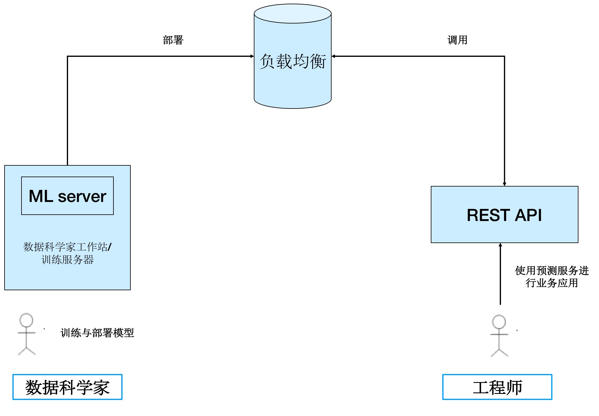

# Prediction.aas

该服务框架可以轻松分布式部署机器学习模型，内置简单负载均衡的功能，生成REST API服务，实现对机器学习的部署、分发、管理、调用统计等，数据科学家只需专心研究算法和建模。

## 快速使用说明

以下测试帮助实现本地机器的实现

### 安装

- pip install firefly-python
  - 使用firefly快速创建服务接口

### 步骤

- 启动master worker
- 启动机器学习服务server
- 向master worker注册机器学习服务
- 使用机器学习服务API进行预测

### 1. 启动master worker

fab start_router(stop_router停止服务)

```Php
#log:
fab start_router

[localhost] local: LOG_CFG=conf/router_log_config.yaml gunicorn --daemon 'router.router_app:loader()' --error-logfile gunicorn.log --access-logfile gunicorn_access.log

Done.
#监听地址:http://localhost:8000
```

### 2. 启动机器学习服务server

```python
# predict.py

def predict(n):
	if n == 0 or n == 1:
		return 1
	else:
		return predict(n-1) + predict(n-2)
```

```php
$ firefly predict.predict -b 127.0.0.1:9001
http://127.0.0.1:9001/
```

```php
$ firefly predict.predict -b 127.0.0.1:9002
http://127.0.0.1:9002/
```

### 3. 向master worker注册机器学习服务

```python
import requests
import json
import falcon

routing_map = {'AI': {'simple_example':[{'host': 'localhost', 'port': 9001, 'local_worker_id': 0},{'host': 'localhost', 'port': 9002, 'local_worker_id': 0]}}

r = requests.put('http://localhost:8000/v1/model_workers_map', data = json.dumps(routing_map))
assert(r.status_code == 200)
#r.content
'{"Register Model Service": "Success"}'
#查询服务信息
import requests
param={"model-type":"AI"}
r = requests.get('http://localhost:8000/v1/model_workers_map', params = param)
#r.content
"{u'localhost-9001-0': <commons.src.load_balancer.worker_info.WorkerInfo instance at 0x101940128>, u'localhost-9002-0': <commons.src.load_balancer.worker_info.WorkerInfo instance at 0x101940200>}"                                        
```

### 4. 使用机器学习服务进行预测

```python
datain = {"modelId":"fib", 'data':{'n':2}}

response = requests.post('http://localhost:8000/v1/AI_model/predict', 
                         data= json.dumps(datain), 
                         headers={'Content-Type': 'application/json'})
print(response.status_code)
200
#预测结果response.content
'2'
#调用情况查询
r = requests.get('http://localhost:8000/elb-healthcheck')
r.content
'{"uptime": 51, "capacity": 100, "requests": {"fib": {"localhost-9001-0": 2, "localhost-9002-0": 1}}}'
```

### 架构

#### End-to-End Workflow



### TODO

- 负载均衡信息持久化(redis)
- ~~服务探活~~
- 管理信息可视化
- 加入train环节和model管理
